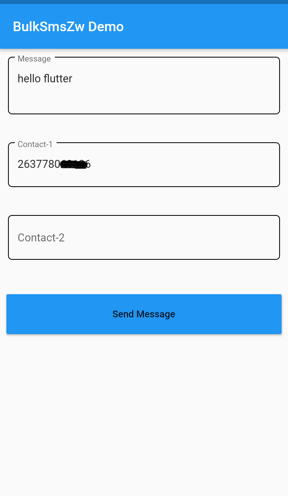
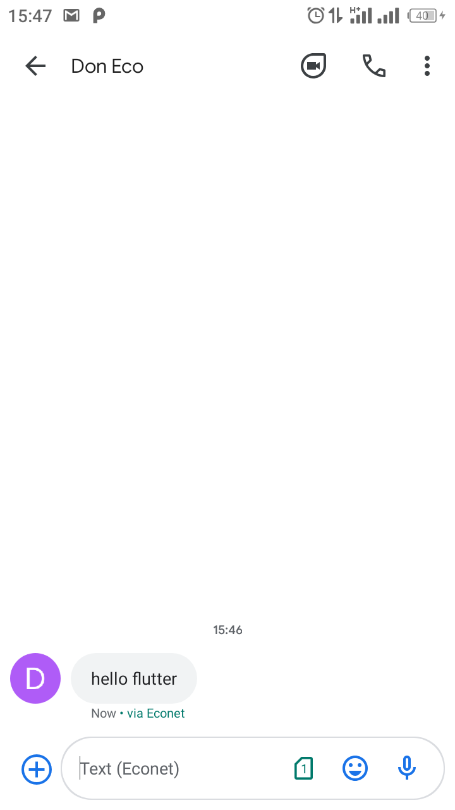

# [bulksmszw](http://www.bulksmsweb.com/)


A flutter or dart plugin for developers to use the `bulksmsweb` api services

* bulksmszw api, a port for [bulksmszw-api python library](https://github.com/DonnC/BulkSmsZW-Api). Send bulk sms using bulksmsweb services

## Authentication details
- register an account on [bulksms website](http://www.bulksmsweb.com/)
- if already have an account, login on [bulksms web portal](http://portal.bulksmsweb.com)
- Got to "My Account", then Click on "User Configuration", to obtain "Webservices token".
- Use your `webservices token` as `bulksmsWebKey` and registered `username` as `bulksmsWebName`

## Usage
[Example](https://github.com/DonnC/bulksmszw/tree/main/example/app)

# Screenshot
<table>
   <tr>
      <td> Demo App</td>
      <td> Sms inbox</td>
   </tr>
   <tr>
      <td>
      <td>
   </tr>
</table>

To use bulksmszw package, add it to your project `pubspec.yaml`
```yaml
dependencies:
  flutter:
    sdk: flutter

  bulksmszw: ^2.0.0-dev
```

## How to use
First import the `bulksmszw` package in your dart file
```dart
import 'package:bulksmszw/bulksmszw.dart';
```

Create a `BulkSmsZw()` object passing in your api-key and api-username

```dart
final smsApi = BulkSmsZw(
      bulksmsWebKey: '<your-api-key>',
      bulksmsWebName: '<your-api-username>',
    );
```

### Send (bulk) SMS
To send a message, pass your `contacts` in a list as a list string
```dart
List<String> contacts = [
    '263777777777',
    '#flutterDev',  // you can pass group names too
];

ApiResponse _response = await smsApi.send(
   message: 'Please be reminded that project deadline is today at 15:45pm',
  recipients: contacts,
);

// you can check response from ApiResponse -> _response
if(_response.statusresponse == SMSRESPONSE.SUCCESS)
{
    showSuccessToast();
}
```

## Features
- [✔]  Send SMS
- [✔]  Customized api response 
- [❌] Schedule messages
- [❌] Validate phone numbers

## Api Changes
Api changes are available on [CHANGELOG](CHANGELOG.md)

### Additionals
- features and pr and contributions are welcome.
- api docs for bulksmsweb at [HTTP API INTEGRATION DOC](http://portal.bulksmsweb.com/downloads/BulkSMS-API.pdf)
- *unofficial bulksmsweb package

## Getting Started

This project is a starting point for a Dart
[package](https://flutter.dev/developing-packages/),
a library module containing code that can be shared easily across
multiple Flutter or Dart projects.

For help getting started with Flutter, view our 
[online documentation](https://flutter.dev/docs), which offers tutorials, 
samples, guidance on mobile development, and a full API reference.
